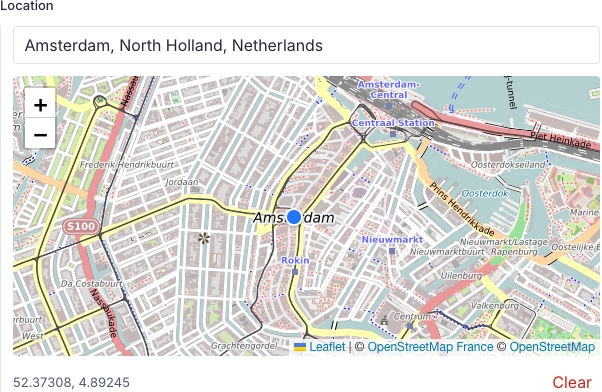

# @eightmedia/sanity-plugin-osm-input

Sanity Studio input for `geopoint` fields: OpenStreetMap-based map tiles,
Photon place search, and a draggable pin.



## Install

```bash
pnpm add @eightmedia/sanity-plugin-osm-input
```

## Usage as a single field (recommended)

```ts
import { OsmGeopointInput } from '@eightmedia/sanity-plugin-osm-input'
import { defineField } from 'sanity'

defineField({
  name: 'location',
  type: 'geopoint',
  components: { input: OsmGeopointInput },
})
```

## Usage as plugin, replacing all geopoint fields for the OSM input

```ts
import { osmInput } from '@eightmedia/sanity-plugin-osm-input'
import { defineConfig } from 'sanity'

export default defineConfig({
  plugins: [osmInput()],
})
```

## Data output

Same as Sanity’s built-in geopoint:

```ts
{ _type: 'geopoint', lat: number, lng: number }
```

## Map & search

- **Tiles:** [OpenStreetMap France](https://www.openstreetmap.fr/)
- **Search:** [Photon](https://github.com/komoot/photon) (Komoot)

## Development

We use pnpm, npm or yarn should also work if you update package.json.

```bash
nvm use   # Node 24
pnpm install
pnpm test
pnpm build
```

For local development and testing, a minimal Studio
is set up in the repo root.
Copy `.env.example` to `.env` and fill the blanks, then run a
studio at localhost:3333 like this:

```bash
pnpm run dev
```
